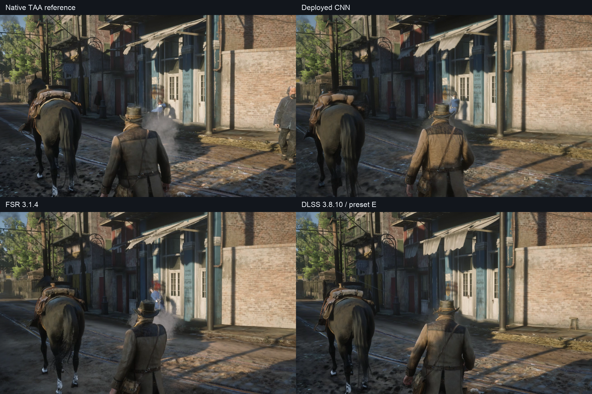
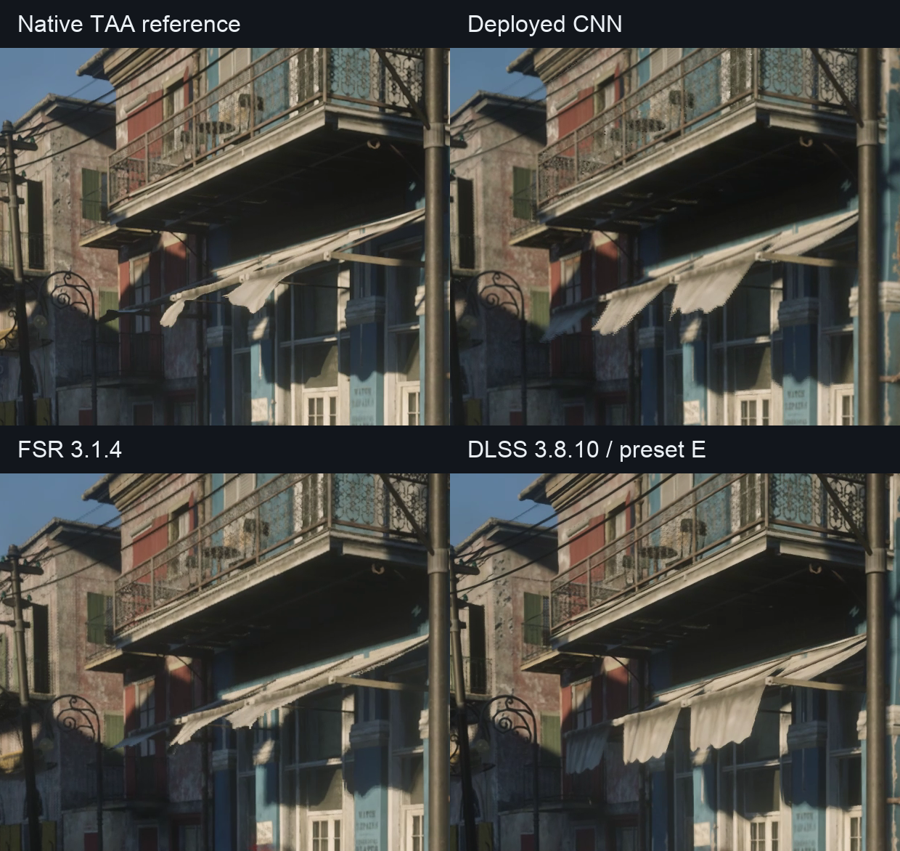

# FSR-Mamba

A learned temporal upscaler in the style of DLSS: a convolutional network that takes the jittered
low-resolution frame, motion vectors, depth and its own previous output, and reconstructs the
high-resolution frame. It is trained on 4x supersampled ground truth captured from Unreal Engine 5
and runs in a shipping game through a DirectX 12 proxy DLL. AMD's FidelityFX Super Resolution
(FSR 3.1.4) is the baseline it is measured against.

The project began as a selective state-space (Mamba) accumulator, which is where the name comes
from. The current model is a plain CNN with no recurrent state; the state-space prototype is kept
as the research history.

The repository has three parts:

1. **Training and evaluation** (`prototype/`): PyTorch models, training and metrics.
2. **Engine capture** (`engine_capture/`): a patch and driver script that dump colour, motion
   vectors, depth and 4x SSAA ground truth from UE5's FSR integration.
3. **Game runtime** (`rdr2_mod/`): a DirectX 12 proxy DLL (HLSL compute shaders plus DirectML)
   that runs the trained network in place of FSR 2 in Red Dead Redemption 2 (story mode only).

## Results

Full-frame evaluation on three held-out UE5 scenes (bistro, brutalism, chess), against 4x SSAA
ground truth, with FSR 3.1.4 captured from the same engine as the baseline.

| Metric | FSR 3.1.4 | CNN (`kpn6_s2`) |
|---|---|---|
| PSNR (dB) | 31.01 | **31.79** (+0.78) |
| SSIM | 0.9557 | **0.9579** (+0.0022) |
| Temporal deviation from ground truth (lower is better) | 0.00249 | **0.00235** |
| Frame-to-frame temporal change | 0.01548 | 0.01561 |

The CNN beats FSR on PSNR, SSIM and ground-truth-referenced temporal deviation. Raw
frame-to-frame change is a poor quality metric on its own (a perfect result still changes when the
scene moves), so it is reported but not optimised.

**Runtime cost.** On an RTX 2070 SUPER at 720p to 1440p, the DirectML build takes about 4.0 ms
per frame (pack 0.66, network 2.3, resolve 0.9), against roughly 1.2 ms for FSR 2. That is above
the original 2 ms goal; the DirectML network floor is about 1.8 ms even for a tiny trunk.

**In game.** In Red Dead Redemption 2 the model resolves fine detail such as hair and texture
better than FSR 2. Foliage shimmer is the main open problem. A live temporal stabiliser
(`rdr2_mod`, preset 5) reduces it; the moving benchmark comparison below measures the deployed
pipeline against a common native-resolution reference.

### Red Dead Redemption 2 benchmark

The deployed CNN, AMD FSR 3.1.4 and CNN-era DLSS 3.8.10 (preset E), each rendering at
**1280x720 to 2560x1440**, compared against a native **2560x1440 high-TAA** reference on
an **RTX 2070 SUPER**. Measured on October 6, 2026, using **41 common aligned frame pairs**
across five benchmark scenes.

| Method | PSNR (dB) ↑ | SSIM ↑ | Temporal error ↓ |
|---|---:|---:|---:|
| Deployed CNN (720p to 1440p) | 29.586 | 0.8154 | **0.02924** |
| FSR 3.1.4 | 29.319 | 0.8024 | 0.03140 |
| DLSS 3.8.10, preset E | **29.960** | **0.8254** | 0.02991 |

In this sample, the CNN scored above FSR 3.1.4 on all three metrics. DLSS led PSNR and SSIM;
the CNN had the lowest temporal error. The CNN row includes the deployed stabiliser
(`stabilize=0.85`). FSR 3.1.4 was verified through OptiScaler with the game's native FSR inputs,
and the DLSS driver override was disabled to keep preset E active.

Lossless RGB recordings were sampled at 15 FPS, with the bottom 100 pixels containing the
benchmark HUD cropped. Temporal error is `mean(abs((method_next - method_current) -
(TAA_next - TAA_current)))` on RGB values in [0,1], over approximately 66.7 ms. It measures
frame-difference residual, rather than motion-compensated flicker. These exploratory results
have a separate protocol from the UE5 table above: native TAA is a reference proxy, and
independent runs vary in NPCs, lighting, particles and timing. Small differences need broader
validation; this quality comparison does not measure uncapped performance.



*City-chase frames matched by camera position from the recorded benchmark passes. The same
1300x800 crop is retained at original pixel size. NPCs, particles and timing vary between
independent runs; the quality table averages all five benchmark scenes.*



*Tighter 620x520 crops of the balcony, railing and awning from the same frames above,
with the same layout and labels. Each crop retains the original pixels.*

[Watch or download the city-chase comparison (MP4, 7.31 MB)](docs/videos/rdr2_city_chase.mp4)

*Eight-second four-way comparison, 2560x1440 at 15 FPS. The video is compressed for sharing;
inspect the PNG crops for still-image detail. Capture cadence does not measure game FPS.*

## Approach

**Current model: a kernel-prediction CNN.** Like DLSS, the network sees what the renderer provides
(jittered colour, motion vectors, depth) plus the previous output, and accumulates samples over
time. It is a kernel-prediction design, not a reproduction of any proprietary model.

- **Inputs**: 16 channels at render resolution: current colour, reprojected history, history
  minus current (normalised by local range), depth mismatch and disocclusion, motion length,
  history age and the sub-pixel jitter.
- **Network**: a U-Net trunk of convolutions, max-pools, bilinear resamples and ReLUs. In the
  real-time configuration it runs at half render resolution (stride 2) and is exported to DirectML.
- **Outputs**: seven values per output pixel: an anisotropic Gaussian (two log-sigmas and an
  angle) over real render-resolution samples, a blend weight for the current frame, a history
  clamp slack and a small colour residual. The result is built from observed colours, so it
  cannot diverge.
- **Accumulation**: history is reprojected with exact Catmull-Rom filtering and weighted by how
  close each sample lands to the output pixel centre. Packing, reprojection, depth rejection and
  the final resolve run in compute shaders; only the trunk runs on DirectML.
- **No recurrent state**: the only things carried between frames are the output colour, the
  per-pixel history age and the previous depth.

Cost fell from 9.2 ms to about 4 ms by moving to the stride-2 trunk, three-tap kernels, fp16
storage and shared-memory tiles in the shaders.

**Earlier prototype: a state-space accumulator (v1 to v67).** A selective state-space model carried
per-pixel temporal state along motion vectors and drove a learned blend, history-rectification box
scale, kernel-prediction head and render-resolution upsampler. Best result on the same held-out
scenes at 1280x710:

| | PSNR (dB) | SSIM | Temporal instability |
|---|---|---|---|
| AMD FSR 3.1.4 | 30.87 | 0.9549 | 0.02153 |
| State-space v64 (372k params) | 31.38 | 0.9546 | 0.02296 |

It matched FSR on image quality but was too slow for a game. The CNN above has no recurrent
state and beats this prototype and FSR on PSNR, SSIM and temporal deviation.

## How the project evolved

Eleven weeks and more than 70 trained models, in four stages. The commit history up to September covers
the first two; October's work is squashed into the last commit.

### 1. A learned accumulator 

The baseline was a Python port of FSR 3.1.4's accumulation pass, checked against AMD's HLSL. On top
of it went a selective state-space (Mamba) accumulator whose per-pixel state is warped along motion
vectors. Trained on procedurally generated motion with known ground truth, it was 4.5x more
temporally stable than the ported baseline (instability 0.0063, PSNR 20.44, SSIM 0.831). That showed
the idea worked, but synthetic data could not say anything about real rendering.

### 2. Real engine data and the search for quality 

A UE5 capture harness dumps colour, motion vectors, depth and a 4x SSAA ground truth for ten scenes
(seven train, three validation). Training on real captures changed what mattered: real disocclusion
and texture detail, not synthetic motion.

| Milestone | Result on held-out scenes |
|---|---|
| Render-resolution upsampler (v17) | Broke the Lanczos ceiling of about 0.9425 SSIM |
| Kernel-prediction head (v39) | Fixed the recurrent divergence; output cannot leave the range of real colours |
| U-Net encoder (v56) | 20x cheaper (28.9 vs 592 GFLOP), 1.69 ms, but SSIM 0.0135 below FSR |
| SSIM and gradient losses, warm start (v64) | PSNR +0.51 dB over FSR, SSIM within 0.0003 |

Dead ends from this stage: expert routing, Swin-transformer refiners, separable convolutions at small
widths, and RCAS sharpening (it lowered PSNR and SSIM at every strength). In September, temporal quality
was re-measured against the ground truth instead of against zero.

### 3. A real game exposes the gap 

The first goal was real time, so the model was split into a render-resolution accumulator ("fast"), a
phase-gated variant, and fused CUDA kernels with a TensorRT backend. Two things then went wrong.

- A bug found on October 2: the captures sample at texel centre plus jitter, but the ported baseline
  assumed minus. Every jitter-aware model trained before that had used the wrong sign.
- On October 2 the model went into Red Dead Redemption 2 through a proxy DLL. It did not look better
  than FSR 2: edges flickered, hair and grass were worse. Metrics on engine captures had not
  predicted that, and the game footage had no ground truth.

The response was new data and a new target. Photo mode freezes the world, so 64 frames of accumulation
give a clean reference for real game content. An attention-based high-end model (`--arch hq`) was
tried and underperformed, and a larger convolutional model matched a smaller one, so capacity was not the
limit.

### 4. A CNN in the style of DLSS 

The state-space part was dropped. The new model is a U-Net CNN with no learned recurrent state that
predicts a per-pixel Gaussian reconstruction filter over real samples and blends it with rectified,
reprojected history, a data flow similar to DLSS 2, trained on this project's own captures.

| Step | Effect |
|---|---|
| CNN replaces the state-space accumulator | Only convolutions, pooling, resampling and ReLU, so it exports cleanly to DirectML |
| Proximity-weighted accumulation | Nearest-sample blending was acting like a two-pixel box blur. Fixing it took a held-out frozen frame from 33.06 to 34.59 dB with no retraining |
| Stride-2 trunk, 3-tap kernels, fp16 shaders | 9.2 ms down to about 4 ms per frame |
| Fine-tune on engine plus frozen game shots (`kpn6_s2`) | Beats FSR on PSNR, SSIM and temporal deviation: 31.79 dB, 0.9579, 0.00235 |
| Live stabiliser, foliage tracker, presets | Tunable shimmer control in game; the plain stabiliser (preset 5) looked best |

Open: cost is still twice the original 2 ms goal, and foliage shimmer needs a proper metric on
moving footage instead of judging by eye.

The two result tables in this README come from different evaluation protocols (full 1280x710 frames
for the state-space prototype, multi-scene full-frame for the CNN), so compare each model with the FSR
baseline in its own table, not across tables.

### Lessons

- Warm-starting from a good checkpoint accounts for most of the quality; training from scratch
  needs 30+ epochs to reach the same level.
- Encoder width sets the SSIM ceiling at fixed training signal; extra losses did not move it.
- RCAS sharpening lowers both PSNR and SSIM at every strength.
- Nearest-sample accumulation behaves like a two-pixel box blur. Proximity-weighted blending
  removed it and gained about 1.5 dB on a held-out frozen frame.
- A sign error in the jitter convention affected every jitter-aware model trained before it was
  found. The UE5 captures use sample position = texel centre + jitter while FSR 2 titles use the
  opposite convention, so the runtime exposes per-axis flips.

## Repository layout

```
prototype/
  train.py               training (--arch kpn is the current model)
  eval_full.py           full-frame evaluation against ground truth
  eval_temporal.py       temporal-quality evaluation
  bench_latency.py       GPU latency benchmark
  fsrmamba/
    kpn.py, kpn_unet.py  kernel-prediction CNN (the current model)
    mamba.py             earlier state-space accumulator
    fast.py, fused.py    fast variant and fused CUDA kernels
    lrnet.py             learned render-resolution upsampler
    baseline.py          ported FSR 3.1.4 accumulator (reference)
    engine_data.py       UE5 capture loader
    metrics.py, evalkit.py   losses and evaluation
  tools/                 ONNX export, latency sweeps, result collection
  tests/                 unit and parity tests (python tests/run_all.py)
engine_capture/          UE5 capture patch and orchestrator
rdr2_mod/                DX12 proxy DLL, shaders, weight exporter, tests
```

## Getting started

```bash
cd prototype
python tests/run_all.py                       # CPU-safe test suite

# train the real-time model on engine captures
python train.py --engine-data /path/to/captures_ssaa --arch kpn \
  --crop 256 --epochs 50 --val-scenes 3 --device cuda --save ../ckpt/kpn.pt

# fine-tune from an existing checkpoint (lower the learning rate: Adam state is not saved)
python train.py ... --init-from ../ckpt/kpn.pt --lr 1e-4 --save ../ckpt/kpn_ft.pt

python eval_full.py --help                    # full-frame evaluation
```

`python train.py --help` lists every option. Captures are not included; `engine_capture/README.md`
describes how to produce them from UE5. Checkpoints and datasets are git-ignored.

To run a model in a game, see [`rdr2_mod/README.md`](rdr2_mod/README.md).

## Remaining improvements

Two visible artifacts remain in moving gameplay:

- **Residual ghosting:** a small amount of trailing remains in some moving details. Improve
  history rejection and clamping around motion and disocclusion while retaining fine detail.
- **Distant-tree flicker:** fine branches and foliage can flicker or shimmer far from the camera.
  Improve selective temporal stabilisation and history confidence without blurring those details.

Validate changes on full-resolution moving clips with camera pans, distant foliage and newly
revealed surfaces. The benchmark scores above do not replace checking these artifacts in motion.

## Attribution

`prototype/fsrmamba/baseline.py` and `colorspace.py` derive from AMD's FidelityFX SDK
(MIT licence, Copyright (c) 2024 Advanced Micro Devices, Inc.). `rdr2_mod/third_party/fsr2`
contains the FSR 2 API headers needed for the proxy DLL, under their original licence.
This is an independent research project and is not affiliated with AMD or Rockstar Games.

## Licence

MIT
